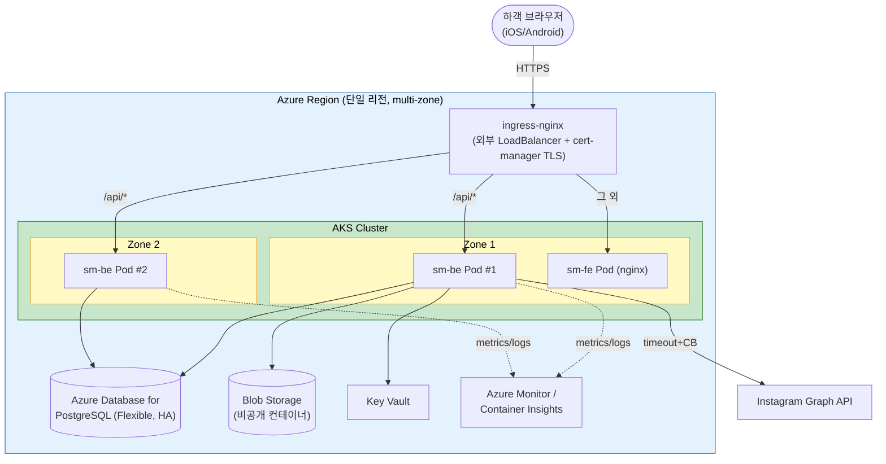

# Deployment Architecture — Unit 1: Backend (`sm-be`)

**[2026-07-18 변경] Azure(AKS) 우선 배포.** GCP(GKE) 이전 경로는 §8 참조.

## 1. 배포 토폴로지 (Azure 우선)



### Text Alternative
```
하객 브라우저 → HTTPS → ingress-nginx(외부 LB + cert-manager TLS)
  - /api/* → sm-be Pod (Zone 1 #1, Zone 2 #2)
  - 그 외   → sm-fe Pod (nginx)
sm-be → Azure Database for PostgreSQL(Flexible, HA), Blob Storage(비공개 컨테이너), Key Vault
sm-be → Instagram Graph API (timeout + circuit breaker)
sm-be → Azure Monitor / Container Insights (메트릭/로그)
```

## 2. 컴퓨트 / 스케일링
- AKS, 백엔드 `Deployment` replicas=2 (가용영역 분산 스케줄링)
- Pod 리소스 request/limit 명시 — 소규모 기준 보수적 사이징
- HPA(선택): CPU 기준 2~4 범위(소규모라 초기엔 고정 2로 충분)
- 배포: Rolling Update(maxUnavailable=0, maxSurge=1) → 무중단, 롤백 `kubectl rollout undo`

## 3. 데이터
- Azure Database for PostgreSQL — Flexible Server, Zone-redundant HA(대기 인스턴스 자동 failover)
- 자동 백업 + PITR 활성화
- 프라이빗 액세스(VNet 통합) 권장, 저장 암호화, TLS 강제
- Flyway가 기동 시 스키마 마이그레이션 적용

## 4. 스토리지
- 단일 비공개 Blob 컨테이너(클러스터 동일 리전), 익명 접근 차단
- 접근: 백엔드가 SAS 서명 URL(TTL 15분) 발급, 컨테이너 직접 공개 없음

## 5. 관측성 / 알림
- Azure Monitor / Container Insights(구조적 로그, PII 마스킹), Micrometer 메트릭(Prometheus scrape)
- 기본 알림: health/readiness 다운, 에러율 급증(예: 5xx 비율 임계 초과) → 이메일 등 알림 채널
- health check: liveness/readiness(+DB) 프로브를 K8s에 연결

## 6. CI/CD (경량, 개인 프로젝트)
- 빌드: `.\gradlew.bat clean build` → 컨테이너 이미지 빌드
- 푸시: ACR(Azure Container Registry, 불변 태그=커밋 SHA)
- 배포: 매니페스트 apply(`kubectl apply -k k8s/overlays/azure`) → Rolling Update
- 롤백: 직전 리비전으로 `rollout undo`
- 변경 관리: 로컬 Git 버전 관리 기반(요구사항 확정)

## 7. Kustomize 구조 (이식성)
```
k8s/
  base/               # 공통: Deployment, Service, HPA, ConfigMap (sm-be + sm-fe)
  overlays/
    azure/            # (primary) ingress-nginx/cert-manager, Key Vault(CSI), Azure PostgreSQL 연결
    gcp/              # (migration) GKE Ingress, managed cert, Workload Identity, Cloud SQL 연결
```
- 애플리케이션 이미지는 공통. provider-specific 리소스는 오버레이에서만 정의 → Azure↔GCP 전환 시 오버레이 교체.

## 8. GCP(GKE) 이전 경로 (migration)
- `k8s/overlays/gcp` 를 그대로 보존. 이전 시: 이미지 재빌드 없이 profile `gcp` + gcp 오버레이 apply.
- 교체 지점: Ingress(managed cert), DB 연결(Cloud SQL), 시크릿(Secret Manager), 워크로드 인증(Workload Identity), 스토리지 SAS↔서명 URL(`StorageClient` 구현).

## 9. 검증
- multi-zone 이중화(2 Pod + PostgreSQL HA)로 zone 장애 대응
- 무중단 배포/롤백 경로 정의
- provider-specific 요소를 오버레이로 격리해 GCP 이전 경로 확보
