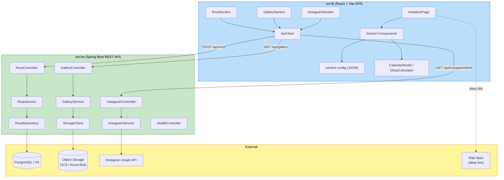

# Component Dependency — 모바일 청첩장

컴포넌트 간 의존성, 통신 패턴, 데이터 흐름.

## 1. 통신 패턴
- **프론트엔드 ↔ 백엔드**: HTTPS/JSON 기반 REST (SPA → REST API)
- **백엔드 ↔ 스토리지**: `StorageClient` 추상화 경유 (GCS 초기 / Azure Blob 이식)
- **백엔드 ↔ Instagram**: 서버 측 토큰으로 Graph API 호출 (timeout 적용)
- **프론트엔드 ↔ 지도 앱**: 클라이언트에서 deep link로 직접 이동 (백엔드 미경유)

## 2. 의존성 다이어그램



### Text Alternative
```
프론트엔드(sm-fe):
- InvitationPage → Section 컴포넌트들 → content config(JSON), CalendarModel/DDayCalculator
- RsvpSection / GallerySection / InstagramSection → ApiClient
- InvitationPage → 지도 앱 (deep link, 직접)

프론트 → 백엔드 (REST):
- ApiClient → RsvpController (POST /api/rsvp)
- ApiClient → GalleryController (GET /api/gallery)
- ApiClient → InstagramController (GET /api/instagram/feed)

백엔드(sm-be):
- RsvpController → RsvpService → RsvpRepository → PostgreSQL/H2
- GalleryController → GalleryService → StorageClient → Object Storage(GCS/Azure)
- InstagramController → InstagramService → Instagram Graph API
- HealthController → (DB 연결 확인)
```

## 3. 의존성 매트릭스 (주요)
| From | To | 유형 | 비고 |
|---|---|---|---|
| Section 컴포넌트 | content config(JSON) | 정적 로드 | ContentProvider 경유 |
| ApiClient | Rsvp/Gallery/Instagram Controller | REST(HTTPS) | 타임아웃/에러 정규화 |
| RsvpService | RsvpRepository | 내부 호출 | 트랜잭션 경계 |
| RsvpRepository | PostgreSQL/H2 | JDBC | 파라미터화 쿼리, Flyway 스키마 |
| GalleryService | StorageClient | 인터페이스 | GCS/Azure 구현 교체 가능 |
| InstagramService | Instagram Graph API | 외부 HTTP | timeout + graceful degradation |
| 전 컨트롤러 | SecurityHeaders/RateLimit/Cors/ExceptionHandler | 횡단 필터 | 요청 파이프라인 |

## 4. 결합도/이식성 노트
- `StorageClient` 인터페이스로 클라우드 스토리지 종속을 격리 → GCS↔Azure Blob 교체 시 구현체만 추가 (요구사항 Q7=A)
- 갤러리·Instagram 서비스는 무상태 → 수평 확장 용이
- RSVP만 상태(DB) 보유 → 백업/복구 대상 (RESILIENCY-12)
