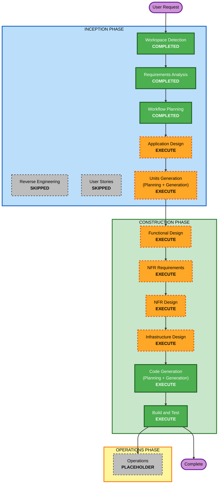

# Execution Plan — 모바일 청첩장

## Detailed Analysis Summary

### Change Impact Assessment
- **User-facing changes**: Yes — 하객이 열람하는 청첩장 페이지 및 RSVP 제출 UX 전체
- **Structural changes**: Yes — 신규 시스템 아키텍처(프론트엔드 + RSVP 백엔드 + 스토리지/외부 연동) 정의 필요
- **Data model changes**: Yes — RSVP 데이터 모델(이름·연락처·참석여부·인원·식사여부) 신규
- **API changes**: Yes — RSVP 제출 API, (필요 시) 갤러리/Instagram 프록시 엔드포인트 신규
- **NFR impact**: Yes — Security/Resiliency 베이스라인 적용(blocking), 성능(모바일 로딩), 크로스플랫폼 호환

### Risk Assessment
- **Risk Level**: Medium — 다중 컴포넌트 + 외부 연동(Instagram/지도) + 클라우드 배포. 단, 개인 프로젝트/이벤트성이라 롤백은 용이
- **Rollback Complexity**: Easy — 로컬 Git 버전 관리 + 재배포
- **Testing Complexity**: Moderate — RSVP 검증/날짜 계산/직렬화에 PBT(Partial) + 예시 기반 테스트

## Workflow Visualization



### Text Alternative (항상 포함)
```
INCEPTION PHASE
- Workspace Detection: COMPLETED
- Reverse Engineering: SKIPPED (greenfield)
- Requirements Analysis: COMPLETED
- User Stories: SKIPPED (사용자 선택)
- Workflow Planning: COMPLETED (현재)
- Application Design: EXECUTE
- Units Generation: EXECUTE

CONSTRUCTION PHASE (per-unit)
- Functional Design: EXECUTE
- NFR Requirements: EXECUTE
- NFR Design: EXECUTE
- Infrastructure Design: EXECUTE
- Code Generation: EXECUTE
- Build and Test: EXECUTE

OPERATIONS PHASE
- Operations: PLACEHOLDER
```

## Phases to Execute

### 🔵 INCEPTION PHASE
- [x] Workspace Detection (COMPLETED)
- [x] Reverse Engineering (SKIPPED — greenfield, 기존 코드 없음)
- [x] Requirements Analysis (COMPLETED)
- [x] User Stories (SKIPPED — 사용자 선택, 단일 페르소나/명확한 흐름)
- [x] Workflow Planning (IN PROGRESS)
- [ ] Application Design - **EXECUTE**
  - **Rationale**: 신규 컴포넌트(프론트엔드 섹션, RSVP 서비스, 스토리지/외부연동 어댑터)와 서비스 계층·의존성 정의 필요
- [ ] Units Generation - **EXECUTE**
  - **Rationale**: 프론트엔드/백엔드/인프라 등 다중 컴포넌트를 작업 단위(unit)로 분해해 순차 구현

### 🟢 CONSTRUCTION PHASE (per-unit)
- [ ] Functional Design - **EXECUTE**
  - **Rationale**: RSVP 데이터 모델, D-Day/캘린더 로직, 입력 검증 규칙 상세 설계. PBT-01 속성 식별 수행
- [ ] NFR Requirements - **EXECUTE**
  - **Rationale**: 성능/보안/리질리언시 NFR 확정 + 기술 스택·PBT 프레임워크 선정(PBT-09). Security/Resiliency 확장(blocking)이 요구
- [ ] NFR Design - **EXECUTE**
  - **Rationale**: 보안 헤더·rate limiting·시크릿 관리, timeout/graceful degradation, health check, 백업 등 NFR 패턴 반영. RESILIENCY-04/14 결정
- [ ] Infrastructure Design - **EXECUTE**
  - **Rationale**: GKE/K8s, Cloud Storage, DB, 단일 리전 multi-zone(RESILIENCY-08), Azure 이식성 매핑
- [ ] Code Generation - **EXECUTE (ALWAYS)**
  - **Rationale**: 구현 계획 및 코드/테스트 생성
- [ ] Build and Test - **EXECUTE (ALWAYS)**
  - **Rationale**: 빌드·테스트·검증 (PBT + 예시 기반 테스트, PBT-08 seed 로깅)

### 🟡 OPERATIONS PHASE
- [ ] Operations - PLACEHOLDER (향후 배포/모니터링 워크플로우)

## Estimated Timeline
- **Total Stages to Execute (남은)**: 8 (Application Design, Units Generation, per-unit FD/NFRA/NFRD/ID, Code Generation, Build and Test)
- **Estimated Duration**: 대화형 진행 — 각 단계 승인 게이트마다 검토

## Success Criteria
- **Primary Goal**: iOS/Android 브라우저에서 동작하는 모바일 청첩장 웹 + RSVP 백엔드
- **Key Deliverables**:
  - 세로 스크롤 + fade-in 프론트엔드(React+Vite) — 전 섹션 구현
  - RSVP API + DB(PostgreSQL/H2 + Flyway)
  - 갤러리(Cloud Storage) 및 Instagram API 연동
  - 컨테이너화(Docker/K8s) 및 GKE 배포 설계, Azure 이식성
- **Quality Gates**:
  - Security 베이스라인 컴플라이언스(blocking) 충족
  - Resiliency 베이스라인 컴플라이언스(blocking) 충족
  - PBT(Partial) + 예시 기반 테스트 통과, 빌드 성공
